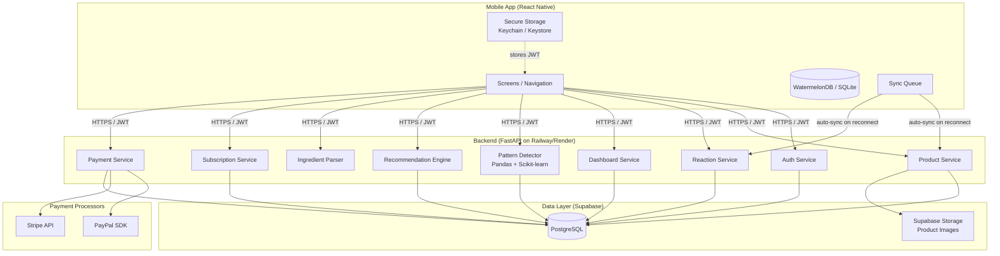
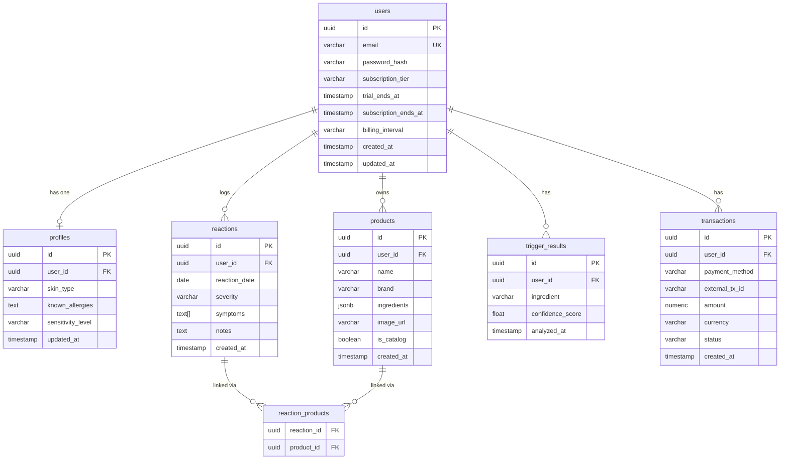
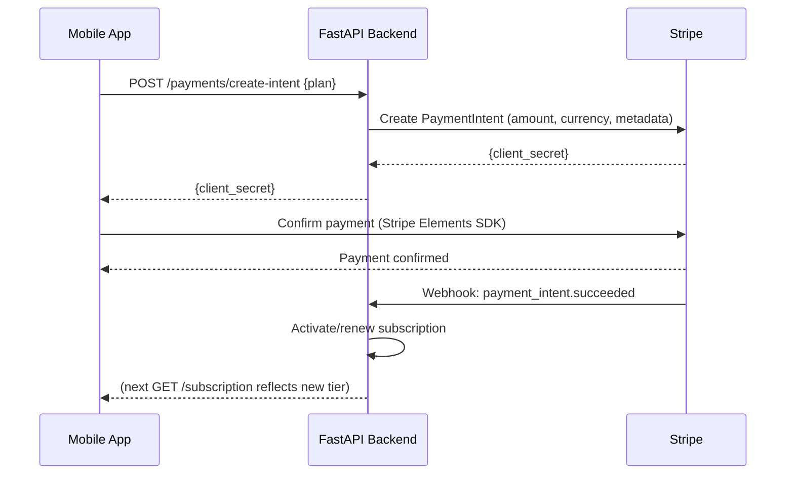
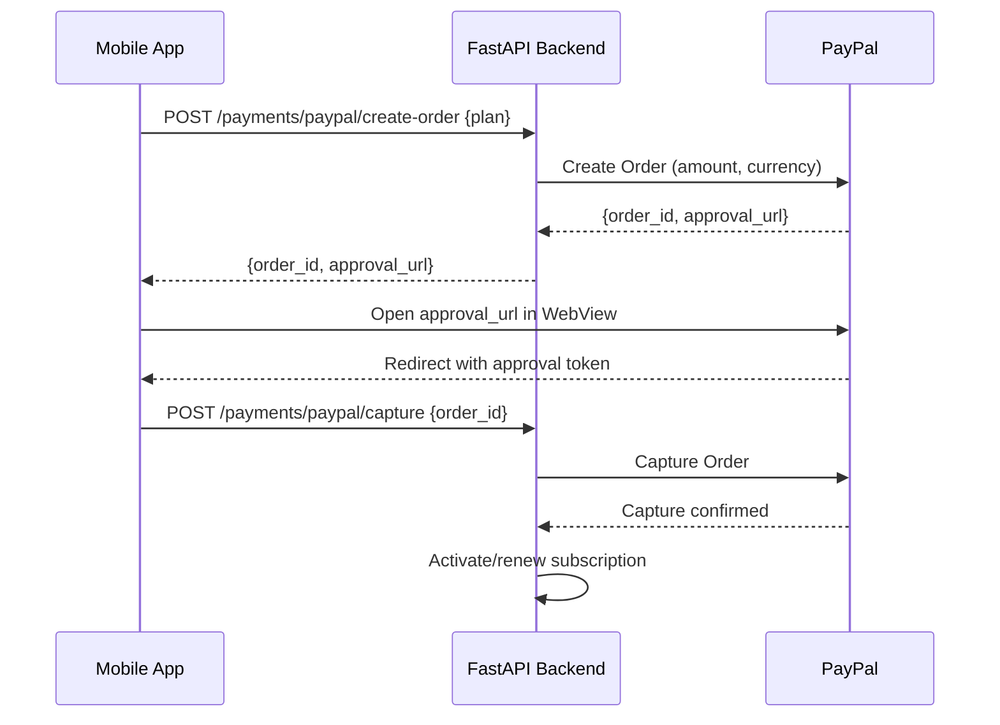
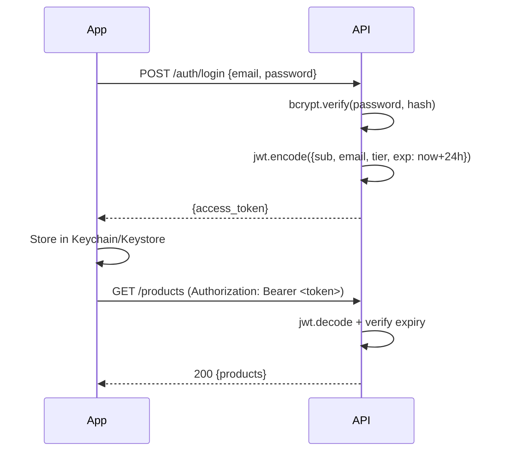
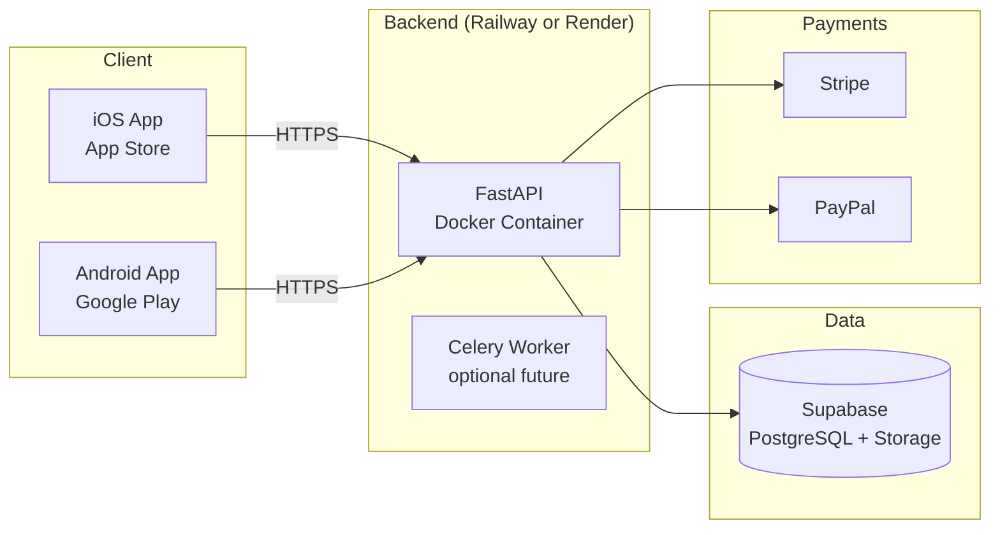

# Design Document: DermaTrace

## Overview

DermaTrace is a freemium SaaS mobile application for cosmetic allergy and skin reaction tracking. Users log products, record reactions, and receive AI-driven insights identifying trigger ingredients and safer product alternatives.

The system is composed of four primary layers:

1. **Mobile App** — React Native (iOS + Android)
2. **Backend API** — Python + FastAPI
3. **Database** — Supabase (PostgreSQL) with SQLAlchemy ORM
4. **AI Service** — Pandas + Scikit-learn pattern detection, embedded in the backend

Payments are handled via PayPal SDK and Stripe (for debit cards). Offline support uses WatermelonDB (SQLite) on-device with a sync queue that flushes to the backend when connectivity is restored.

---

## Architecture



### Key Design Decisions

- **FastAPI** chosen for async support, automatic OpenAPI docs, and Pydantic-based validation.
- **Supabase** provides managed PostgreSQL, row-level security, and built-in file storage for product images.
- **SQLAlchemy** (async) as ORM for type-safe queries and migration support via Alembic.
- **WatermelonDB** for offline-first local storage on React Native — it uses SQLite under the hood and has a built-in sync protocol.
- **Stripe** handles debit card payments (PCI-DSS SAQ A compliant via Stripe Elements); **PayPal JS SDK** handles PayPal flows. Raw card data never touches DermaTrace servers.
- The AI layer is embedded in the FastAPI process as a service module (not a separate microservice) to keep deployment simple at this scale.

---

## Components and Interfaces

### 1. Auth Service

Handles registration, login, and JWT issuance.

- `POST /auth/register` — create user, return JWT
- `POST /auth/login` — verify credentials, return JWT
- `POST /auth/logout` — client-side token removal (stateless)
- JWT middleware applied to all protected routes via FastAPI dependency injection
- Tokens signed with HS256, 24-hour expiry, stored in `Authorization: Bearer` header

### 2. Product Service

CRUD for user products.

- `POST /products` — create product (with optional image upload to Supabase Storage)
- `GET /products` — list user's products
- `DELETE /products/{id}` — delete product (ownership check)
- `POST /products/parse-ingredients` — delegate to Ingredient Parser

### 3. Reaction Service

CRUD for skin reactions.

- `POST /reactions` — create reaction (validates linked product ownership)
- `GET /reactions` — list user's reactions, ordered by date desc

### 4. Dashboard Service

Aggregation queries for the dashboard screen.

- `GET /dashboard` — returns timeline events, 30-day reaction chart data, top 3 products by reaction count, top 3 symptoms

### 5. Pattern Detector (AI Service)

Co-occurrence analysis using Pandas + Scikit-learn.

- `GET /analysis/triggers` — run pattern detection for authenticated user
- Returns list of `{ingredient, confidence_score}` objects
- Requires ≥ 3 reactions; returns 400 with message if insufficient data
- Response time target: ≤ 5 seconds for up to 500 reactions

### 6. Recommendation Engine

- `GET /recommendations` — returns up to 10 catalog products excluding user's trigger ingredients
- Requires trigger analysis to have been run first

### 7. Ingredient Parser

- `POST /ingredients/parse` — accepts `{raw: string}`, returns `{ingredients: string[]}`
- Handles comma and slash delimiters, trims whitespace

### 8. Subscription Service

- `GET /subscription` — current tier, trial status, renewal date
- `POST /subscription/upgrade` — initiate Pro upgrade
- `POST /subscription/cancel` — cancel subscription
- `POST /subscription/change-plan` — switch monthly ↔ annual

### 9. Payment Service

- `POST /payments/create-intent` — create Stripe PaymentIntent for debit card
- `POST /payments/paypal/create-order` — create PayPal order
- `POST /payments/paypal/capture` — capture PayPal order after user approval
- `GET /payments/history` — billing history for authenticated user
- Stripe webhook handler: `POST /webhooks/stripe`
- PayPal webhook handler: `POST /webhooks/paypal`

---

## Data Models

### Database Schema (PostgreSQL via Supabase)



### SQLAlchemy Model Notes

- `products.ingredients` — `JSONB` column storing `["Niacinamide", "Zinc PCA", ...]`
- `reactions.symptoms` — PostgreSQL `TEXT[]` array column
- `users.subscription_tier` — enum: `free`, `pro`, `trial`
- `users.billing_interval` — enum: `monthly`, `annual`, `null`
- `products.is_catalog` — `true` for system-wide catalog products used by Recommendation Engine
- Soft deletes not used; hard deletes with cascade on `reaction_products`
- All primary keys are UUIDs (v4), generated server-side

### Offline Local Schema (WatermelonDB)

Mirrors the server schema with additional sync metadata columns:

| Column | Purpose |
|---|---|
| `_status` | `synced`, `created`, `updated`, `deleted` |
| `_changed` | comma-separated list of changed fields |
| `server_id` | UUID from server after first sync |

Tables mirrored locally: `products`, `reactions`, `reaction_products`

---

## API Design

### Authentication

All protected endpoints require:
```
Authorization: Bearer <jwt_token>
```

JWT payload:
```json
{
  "sub": "<user_uuid>",
  "email": "user@example.com",
  "tier": "pro",
  "exp": 1234567890
}
```

### Key Endpoint Shapes

#### POST /auth/register
```json
// Request
{ "email": "user@example.com", "password": "securepass123" }

// Response 201
{ "access_token": "<jwt>", "token_type": "bearer" }

// Error 409
{ "detail": "Email already registered" }
```

#### POST /products
```json
// Request
{
  "name": "CeraVe Moisturizing Cream",
  "brand": "CeraVe",
  "ingredients": ["Aqua", "Glycerin", "Cetearyl Alcohol"],
  "image_url": "https://storage.supabase.co/..."
}

// Response 201
{ "id": "<uuid>", "name": "...", "brand": "...", "ingredients": [...], "created_at": "..." }
```

#### POST /reactions
```json
// Request
{
  "reaction_date": "2024-01-15",
  "severity": "moderate",
  "symptoms": ["rash", "itching"],
  "product_ids": ["<uuid1>", "<uuid2>"],
  "notes": "Appeared 2 hours after application"
}

// Response 201
{ "id": "<uuid>", "reaction_date": "...", "severity": "...", "symptoms": [...], ... }
```

#### GET /dashboard
```json
// Response 200
{
  "timeline": [
    { "type": "product", "date": "2024-01-14", "name": "CeraVe Moisturizing Cream" },
    { "type": "reaction", "date": "2024-01-15", "severity": "moderate", "symptoms": ["rash"] }
  ],
  "reaction_chart": [
    { "date": "2024-01-01", "count": 0 },
    { "date": "2024-01-15", "count": 1 }
  ],
  "top_products": [
    { "id": "<uuid>", "name": "...", "reaction_count": 3 }
  ],
  "top_symptoms": [
    { "symptom": "rash", "count": 5 }
  ]
}
```

#### GET /analysis/triggers
```json
// Response 200
{
  "triggers": [
    { "ingredient": "Fragrance", "confidence_score": 0.87 },
    { "ingredient": "Methylparaben", "confidence_score": 0.72 }
  ],
  "analyzed_at": "2024-01-15T10:00:00Z"
}

// Response 400 (insufficient data)
{ "detail": "Insufficient data: at least 3 reactions required for analysis" }
```

#### POST /ingredients/parse
```json
// Request
{ "raw": "Aqua, Glycerin / Niacinamide, Zinc PCA" }

// Response 200
{ "ingredients": ["Aqua", "Glycerin", "Niacinamide", "Zinc PCA"] }
```

#### POST /payments/create-intent (Stripe debit card)
```json
// Request
{ "plan": "monthly" }

// Response 200
{ "client_secret": "pi_xxx_secret_xxx", "amount": 499, "currency": "usd" }
```

---

## React Native App Structure

### Navigation

```
RootNavigator
├── AuthStack (unauthenticated)
│   ├── LoginScreen
│   ├── RegisterScreen
│   └── OnboardingScreen
└── AppTabs (authenticated)
    ├── DashboardScreen
    ├── ProductsStack
    │   ├── ProductListScreen
    │   ├── AddProductScreen
    │   └── ProductDetailScreen
    ├── ReactionsStack
    │   ├── ReactionListScreen
    │   └── AddReactionScreen
    ├── InsightsStack (Pro)
    │   ├── TriggerAnalysisScreen
    │   └── RecommendationsScreen
    └── ProfileStack
        ├── ProfileScreen
        ├── SubscriptionScreen
        └── BillingScreen
```

### State Management

- **Zustand** for global app state (auth token, user tier, sync status)
- **React Query (TanStack Query)** for server state (products, reactions, dashboard data) — handles caching, background refetch, and loading states
- **WatermelonDB** reactive queries for offline-first local data

### Key Libraries

| Purpose | Library |
|---|---|
| Navigation | React Navigation v6 |
| State | Zustand + React Query |
| Offline DB | WatermelonDB |
| Secure Storage | `react-native-keychain` |
| Camera | `react-native-vision-camera` |
| Charts | `react-native-gifted-charts` |
| Payments | `@stripe/stripe-react-native` + PayPal JS SDK (WebView) |
| Network detection | `@react-native-community/netinfo` |

---

## AI Pattern Detection Approach

### Algorithm: Co-occurrence Frequency Analysis

The Pattern Detector uses a co-occurrence matrix approach to identify ingredients that appear disproportionately often across products linked to reactions.

#### Steps

1. **Data Loading**: Fetch all reactions and their linked products' ingredient lists for the user.
2. **Ingredient Flattening**: For each reaction, collect the union of all ingredients across linked products into a flat list.
3. **Co-occurrence Matrix**: Build a matrix where each cell `M[i][j]` counts how many reactions involved both ingredient `i` and ingredient `j`.
4. **Frequency Scoring**: Count how many reactions each ingredient appears in (`reaction_count[ingredient]`).
5. **Confidence Score**: Normalize by total reactions:

```
confidence(ingredient) = reaction_count[ingredient] / total_reactions
```

6. **Baseline Adjustment**: Subtract a baseline frequency derived from the catalog (how common the ingredient is across all products) to reduce false positives from ubiquitous ingredients like "Aqua".

```
adjusted_confidence(ingredient) = raw_confidence - catalog_frequency(ingredient)
adjusted_confidence = max(0.0, adjusted_confidence)  # clamp to [0, 1]
```

7. **Ranking**: Sort by adjusted confidence descending, return top results with scores.

#### Scikit-learn Usage

- `sklearn.preprocessing.MultiLabelBinarizer` to encode ingredient sets per reaction into a binary matrix
- Pandas DataFrame for aggregation and frequency counting
- Future enhancement: `sklearn.ensemble.RandomForestClassifier` for multi-feature trigger prediction (skin type, sensitivity level as features)

#### Performance

- For ≤ 500 reactions, the analysis runs in-memory with Pandas — no background job needed
- Results are cached in `trigger_results` table with `analyzed_at` timestamp; re-analysis only triggered on explicit user request or when new reactions are added

---

## Payment Integration Approach

### Stripe (Debit Card)



- Stripe Elements (`@stripe/stripe-react-native`) renders the card input — raw card data goes directly to Stripe, never to DermaTrace servers
- Subscription renewals handled via Stripe Subscriptions (recurring billing)
- Webhook signature verified with `stripe.webhook.construct_event`

### PayPal



- PayPal recurring billing uses PayPal Subscriptions API (not one-time orders) for Pro tier
- PayPal credentials (client ID, secret) stored as environment variables, never in client code

### PCI-DSS Compliance

- Stripe: SAQ A compliant — card data handled entirely by Stripe Elements iframe/SDK
- PayPal: SAQ A compliant — payment handled in PayPal-hosted flow
- DermaTrace servers never receive, process, or store raw card numbers, CVV, or full PayPal credentials
- `transactions` table stores only: payment method type, external transaction ID, amount, status

---

## Offline Sync Strategy

### WatermelonDB Sync Protocol

WatermelonDB implements a push/pull sync protocol. The backend exposes two sync endpoints:

```
GET /sync/pull?last_pulled_at=<timestamp>   → returns changes since last sync
POST /sync/push                              → accepts local changes
```

### Pull Response Shape

```json
{
  "changes": {
    "products": {
      "created": [...],
      "updated": [...],
      "deleted": ["<id1>", "<id2>"]
    },
    "reactions": { "created": [...], "updated": [...], "deleted": [] }
  },
  "timestamp": 1705312800
}
```

### Conflict Resolution

- **Strategy**: Last-write-wins by `updated_at` timestamp
- On push, if server record has a newer `updated_at` than the local record, server version wins
- Deletions always win over updates (if a record is deleted server-side, local updates are discarded)

### Sync Trigger Points

1. App foreground resume (via `AppState` listener)
2. Network connectivity restored (via `NetInfo` listener)
3. After any local write operation (debounced 2 seconds)

### Sync Status Indicator

Zustand store tracks `syncStatus: 'synced' | 'pending' | 'syncing' | 'error'`. A persistent banner is shown when status is `pending` or `error`.

---

## Security Design

### JWT Flow



### Security Controls

| Control | Implementation |
|---|---|
| Password hashing | bcrypt, cost factor 12 |
| Token storage | iOS Keychain / Android Keystore via `react-native-keychain` |
| Transport security | HTTPS enforced in production; HTTP Strict Transport Security header |
| Input validation | Pydantic schemas on all request bodies; 422 on violation |
| Field length limits | Max 10,000 chars enforced in Pydantic validators |
| Ownership checks | Every resource query filters by `user_id = current_user.id` |
| SQL injection | Prevented by SQLAlchemy parameterized queries |
| Rate limiting | FastAPI middleware (slowapi) on auth endpoints |
| Secrets management | Environment variables via Railway/Render secret injection |
| PCI-DSS | Stripe Elements + PayPal hosted flow; no raw card data on server |

### Row-Level Security (Supabase)

Supabase RLS policies enforce that users can only read/write their own rows, providing a defense-in-depth layer even if application-level checks are bypassed.

---

## Deployment Architecture



### Environment Configuration

| Variable | Purpose |
|---|---|
| `DATABASE_URL` | Supabase PostgreSQL connection string |
| `JWT_SECRET` | HS256 signing key |
| `STRIPE_SECRET_KEY` | Stripe API key |
| `STRIPE_WEBHOOK_SECRET` | Stripe webhook signature verification |
| `PAYPAL_CLIENT_ID` | PayPal app client ID |
| `PAYPAL_CLIENT_SECRET` | PayPal app secret |
| `SUPABASE_URL` | Supabase project URL |
| `SUPABASE_SERVICE_KEY` | Supabase service role key (server-side only) |

### CI/CD

- GitHub Actions: lint → test → build Docker image → deploy to Railway/Render on merge to `main`
- Alembic migrations run as a pre-deploy step
- React Native: EAS Build (Expo Application Services) for iOS and Android builds; EAS Submit for store distribution

---

## Correctness Properties

*A property is a characteristic or behavior that should hold true across all valid executions of a system — essentially, a formal statement about what the system should do. Properties serve as the bridge between human-readable specifications and machine-verifiable correctness guarantees.*

### Property 1: Password Storage Security

*For any* valid registration request (valid email, password ≥ 8 characters), the password stored in the database should be a valid bcrypt hash with cost factor ≥ 12, and should never equal the plaintext password.

**Validates: Requirements 1.1, 9.2**

---

### Property 2: JWT Issuance on Authentication

*For any* successful authentication event (registration or login with correct credentials), the returned JWT should be decodable, contain the correct user subject (`sub`), and have an expiry approximately 24 hours from the time of issuance (within a 60-second tolerance).

**Validates: Requirements 1.5, 2.1**

---

### Property 3: Duplicate Email Rejection

*For any* email address already registered in the system, a subsequent registration attempt with that same email should return HTTP 409.

**Validates: Requirements 1.2**

---

### Property 4: Invalid Credentials Rejection

*For any* login attempt using either an incorrect password for an existing user or an email address not present in the system, the response should be HTTP 401.

**Validates: Requirements 2.2, 2.3**

---

### Property 5: Expired Token Rejection

*For any* JWT token whose expiry timestamp is in the past, a request to any protected endpoint using that token should return HTTP 401.

**Validates: Requirements 2.5**

---

### Property 6: Profile Update Round-Trip

*For any* authenticated user and any valid profile update (skin type ∈ {normal, dry, oily, combination, sensitive}, sensitivity ∈ {low, medium, high}), submitting the update and then fetching the profile should return the same values that were submitted.

**Validates: Requirements 3.2**

---

### Property 7: Enum Validation Rejection

*For any* request containing a skin type or sensitivity level value outside the accepted enums, the system should return HTTP 422.

**Validates: Requirements 3.3, 3.4, 3.5**

---

### Property 8: Product Creation and Retrieval Round-Trip

*For any* authenticated user and any valid product (name, brand, ingredients as a non-empty array of strings), creating the product and then fetching the product list should include a product with the same name, brand, and ingredient array.

**Validates: Requirements 4.1, 4.7**

---

### Property 9: Product List Completeness

*For any* authenticated user who has created N products, the product list endpoint should return exactly N products (assuming no deletions).

**Validates: Requirements 4.3**

---

### Property 10: Product Ownership Enforcement

*For any* product owned by user A, a deletion request from user B (a different authenticated user) should return HTTP 403, and the product should remain in user A's product list.

**Validates: Requirements 4.5, 5.2**

---

### Property 11: Reaction Creation Round-Trip

*For any* authenticated user and any valid reaction (date, severity ∈ {mild, moderate, severe}, at least one valid symptom, at least one owned product ID), creating the reaction and then fetching the reaction history should include a reaction with the same field values.

**Validates: Requirements 5.1, 5.6**

---

### Property 12: Reaction History Ordering

*For any* authenticated user with multiple reactions logged on different dates, the reaction history endpoint should return reactions ordered by date descending (most recent first).

**Validates: Requirements 5.4**

---

### Property 13: Dashboard Aggregation Correctness

*For any* authenticated user, the dashboard response should satisfy: (a) the timeline is ordered chronologically, (b) the reaction chart contains only dates within the past 30 days, (c) `top_products` contains at most 3 items and they are the products with the highest reaction counts, and (d) `top_symptoms` contains at most 3 items and they are the most frequently logged symptoms.

**Validates: Requirements 6.1, 6.2, 6.3, 6.4**

---

### Property 14: Trigger Analysis Output Invariant

*For any* authenticated user with ≥ 3 logged reactions, the trigger analysis endpoint should return a list of ingredients where every confidence score is in the range [0.0, 1.0], and ingredients appearing in more reactions should have confidence scores ≥ ingredients appearing in fewer reactions (monotonicity).

**Validates: Requirements 7.1, 7.2, 7.4**

---

### Property 15: Recommendation Trigger Exclusion

*For any* authenticated user with identified trigger ingredients, every product returned by the recommendation endpoint should have an ingredient list that contains none of the user's trigger ingredients, and the list should contain at most 10 products.

**Validates: Requirements 8.1, 8.4**

---

### Property 16: Recommendation Response Completeness

*For any* recommendation result, each product in the response should include a non-null name, brand, and non-empty ingredient list.

**Validates: Requirements 8.3**

---

### Property 17: Protected Endpoint Authorization

*For any* protected API endpoint, a request made without an `Authorization` header (or with a malformed/invalid JWT) should return HTTP 401.

**Validates: Requirements 9.1**

---

### Property 18: Field Length Validation

*For any* request payload containing a string field exceeding 10,000 characters, the system should return HTTP 422.

**Validates: Requirements 9.5**

---

### Property 19: Ingredient Parser Round-Trip

*For any* valid raw ingredient string (non-empty, comma or slash separated), parsing the string to an array, formatting the array back to a canonical comma-separated string, and parsing again should produce an array equivalent to the first parse result (same elements in the same order, with whitespace trimmed).

**Validates: Requirements 10.1, 10.3, 10.4, 10.5**

---

### Property 20: Sync Conflict Resolution

*For any* pair of versions of the same record (identified by the same `server_id`), the sync merge function should always select the version with the later `updated_at` timestamp as the winner.

**Validates: Requirements 11.2**

---

### Property 21: Free Tier Limit Enforcement

*For any* free-tier user who has already logged 10 products, attempting to create an additional product should return HTTP 403. Similarly, for any free-tier user who has already logged 20 reactions, attempting to create an additional reaction should return HTTP 403.

**Validates: Requirements 12.1, 12.7, 12.8**

---

### Property 22: Free Tier Feature Restriction

*For any* free-tier user, requests to the Pattern Detector, Recommendation Engine, Ingredient Parser, and offline sync endpoints should return HTTP 403.

**Validates: Requirements 12.2**

---

### Property 23: Trial Activation on Registration

*For any* newly registered user, the system should set `subscription_tier = trial` and `trial_ends_at = registration_time + 14 days` (within a 60-second tolerance).

**Validates: Requirements 12.4**

---

### Property 24: Trial Expiry Tier Reversion

*For any* user whose `trial_ends_at` is in the past and who has no active Pro subscription, the effective tier returned by the subscription endpoint should be `free`.

**Validates: Requirements 12.5**

---

### Property 25: Cancellation Access Preservation

*For any* Pro user who cancels their subscription, the subscription endpoint should continue to return `tier = pro` until `subscription_ends_at`, and return `tier = free` after that date.

**Validates: Requirements 12.9, 13.9**

---

### Property 26: Post-Cancellation Data Preservation

*For any* user whose tier reverts from Pro to Free (after cancellation or trial expiry), all previously created Product and Reaction records should remain accessible via the list endpoints.

**Validates: Requirements 12.10**

---

### Property 27: No Raw Payment Data in Transactions

*For any* transaction record in the database, the record should not contain raw card numbers, CVV codes, or full PayPal credentials — only payment method type, external transaction ID, amount, and status.

**Validates: Requirements 13.3, 13.10**

---

### Property 28: Payment Success Activates Subscription

*For any* successful payment event (confirmed by payment processor webhook), the user's `subscription_tier` should be updated to `pro` and a corresponding transaction record should exist with `status = succeeded`.

**Validates: Requirements 13.4**

---

### Property 29: Payment Failure Does Not Activate Subscription

*For any* failed payment event, the user's `subscription_tier` should remain unchanged from its pre-payment value.

**Validates: Requirements 13.5**

---

### Property 30: Billing History Completeness

*For any* authenticated user with at least one transaction, the billing endpoint should return the current subscription tier, next renewal date, and a list of transactions each containing date, amount, and payment method.

**Validates: Requirements 13.6**

---

## Error Handling

### Error Response Format

All errors follow a consistent JSON shape:

```json
{
  "detail": "Human-readable error message"
}
```

For validation errors (422), FastAPI/Pydantic returns a structured list:

```json
{
  "detail": [
    {
      "loc": ["body", "field_name"],
      "msg": "error description",
      "type": "value_error"
    }
  ]
}
```

### Error Catalog

| Scenario | HTTP Status | Message |
|---|---|---|
| Email already registered | 409 | "Email already registered" |
| Invalid email format | 422 | "Invalid email format" |
| Password too short | 422 | "Password must be at least 8 characters" |
| Invalid credentials | 401 | "Invalid email or password" |
| Expired/missing JWT | 401 | "Not authenticated" |
| Invalid skin type | 422 | "skin_type must be one of: normal, dry, oily, combination, sensitive" |
| Invalid sensitivity | 422 | "sensitivity_level must be one of: low, medium, high" |
| Missing product name | 422 | "field required" |
| Product not found / wrong owner | 403 | "Access denied" |
| Invalid reaction severity | 422 | "severity must be one of: mild, moderate, severe" |
| Insufficient reactions for analysis | 400 | "Insufficient data: at least 3 reactions required for analysis" |
| No triggers for recommendations | 400 | "Trigger analysis must be completed before recommendations can be generated" |
| Empty ingredient string | 422 | "Input must not be empty" |
| Free tier product limit | 403 | "Free tier limit reached: maximum 10 products. Upgrade to Pro for unlimited logging." |
| Free tier reaction limit | 403 | "Free tier limit reached: maximum 20 reactions. Upgrade to Pro for unlimited logging." |
| Pro feature on free tier | 403 | "This feature requires a Pro subscription." |
| Field exceeds 10,000 chars | 422 | "Field exceeds maximum length of 10,000 characters" |
| Payment failed | 402 | "Payment failed: {processor_message}" |

### Backend Error Handling Strategy

- FastAPI exception handlers registered globally for `RequestValidationError` (422) and `HTTPException`
- Unhandled exceptions caught by a generic 500 handler that logs the traceback and returns a sanitized message (no stack traces exposed to clients)
- Database connection errors trigger a 503 response
- Payment processor errors are mapped to 402 with the processor's error message forwarded (after sanitization)
- All errors logged with request ID for traceability

---

## Testing Strategy

### Dual Testing Approach

Both unit tests and property-based tests are required. They are complementary:

- **Unit tests** verify specific examples, integration points, and error conditions
- **Property-based tests** verify universal properties across many generated inputs

### Property-Based Testing

**Library**: `hypothesis` (Python) for backend; `fast-check` for any React Native logic tested in Jest.

**Configuration**: Each property test runs a minimum of 100 iterations (`@settings(max_examples=100)`).

**Tag format**: Each property test must include a comment:
```python
# Feature: dermatrace, Property {N}: {property_text}
```

**One test per property**: Each of the 30 correctness properties above maps to exactly one property-based test.

Example property test structure:

```python
from hypothesis import given, settings, strategies as st

# Feature: dermatrace, Property 19: Ingredient Parser Round-Trip
@given(st.lists(
    st.text(min_size=1, alphabet=st.characters(blacklist_characters=",/")),
    min_size=1, max_size=20
))
@settings(max_examples=100)
def test_ingredient_parser_round_trip(ingredients):
    raw = ", ".join(ingredients)
    parsed_once = parse_ingredients(raw)
    formatted = ", ".join(parsed_once)
    parsed_twice = parse_ingredients(formatted)
    assert parsed_once == parsed_twice
```

### Unit Testing

**Framework**: `pytest` (backend), `Jest` + `React Native Testing Library` (mobile).

Unit tests focus on:
- Specific examples demonstrating correct behavior (e.g., a known ingredient string parses to a known array)
- Integration points (e.g., Stripe webhook handler correctly updates subscription tier)
- Edge cases: empty ingredient string, user with exactly 3 reactions, trial expiry boundary

Avoid writing unit tests that duplicate what property tests already cover (e.g., don't write 50 unit tests for different invalid email formats when a property test covers all of them).

### Test Organization

```
backend/
  tests/
    unit/
      test_auth.py
      test_products.py
      test_reactions.py
      test_dashboard.py
      test_pattern_detector.py
      test_ingredient_parser.py
      test_subscription.py
      test_payments.py
    property/
      test_auth_properties.py        # Properties 1-5
      test_profile_properties.py     # Properties 6-7
      test_product_properties.py     # Properties 8-10
      test_reaction_properties.py    # Properties 11-12
      test_dashboard_properties.py   # Property 13
      test_ai_properties.py          # Properties 14-16
      test_security_properties.py    # Properties 17-18
      test_parser_properties.py      # Property 19
      test_sync_properties.py        # Property 20
      test_subscription_properties.py # Properties 21-26
      test_payment_properties.py     # Properties 27-30
    integration/
      test_auth_flow.py
      test_payment_flow.py
      test_sync_flow.py

mobile/
  __tests__/
    screens/
    components/
    sync/
```

### Coverage Targets

- Backend: ≥ 80% line coverage
- Property tests: 100% of testable acceptance criteria covered
- Integration tests: all payment flows (Stripe + PayPal) covered with mocked processor responses
